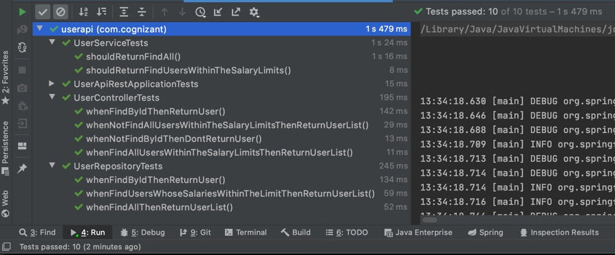

# Technical Challenge

Develop a web application with one endpoint, eg GET http://localhost:8080/users

## Getting Started

This backend version of the User API application only provides a REST API. There is no UI.

## Running User API locally
### With maven command line
```
git clone https://github.com/harinathk/user-api-rest.git
cd user-api-rest
./mvnw spring-boot:run
```
## Database configuration
In its default configuration, User API uses an in-memory database (H2) which gets populated at startup with data. A similar setups is provided for MySql in case a persistent database configuration is needed. To run user api locally using persistent database, it is needed to change profile defined in application.properties file.

For MySQL database, it is needed to change param "h2db" to "mysql" in string
```
spring.profiles.active=h2db
```
defined in application.properties file.

Before do this, would be good to check properties defined in application-mysql.properties file.

```
spring.datasource.url = jdbc:mysql://localhost:3306/users?useUnicode=true
spring.datasource.username=ua
spring.datasource.password=userapi
spring.datasource.driver-class-name=com.mysql.jdbc.Driver
spring.jpa.database=MYSQL
spring.jpa.database-platform=org.hibernate.dialect.MySQLDialect
spring.jpa.hibernate.ddl-auto=none
```
### API json Response
GET http://localhost:8080/users
```json
{
    "results": [
        {
            "name": "Isabella",
            "salary": 1731.0
        },
        {
            "name": "Tyler",
            "salary": 891.0
        },
        {
            "name": "Jacob",
            "salary": 2607.0
        },
        {
            "name": "Lenny",
            "salary": 4000.0
        },
        {
            "name": "Aida",
            "salary": 698.0
        },
        {
            "name": "Chelsea",
            "salary": 3589.0
        }
    ]
}
```
Error Response
```json
{
    "code": "204",
    "message": "Users Not Found",
    "details": "uri=/users"
}
```
### Test Results


